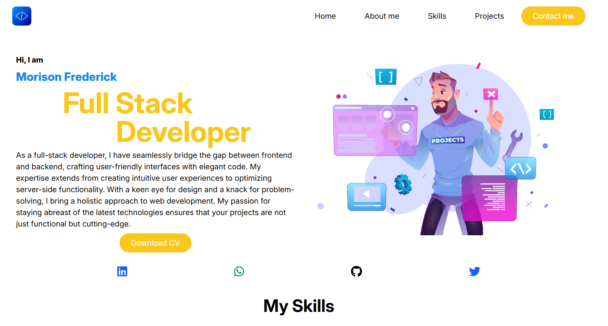
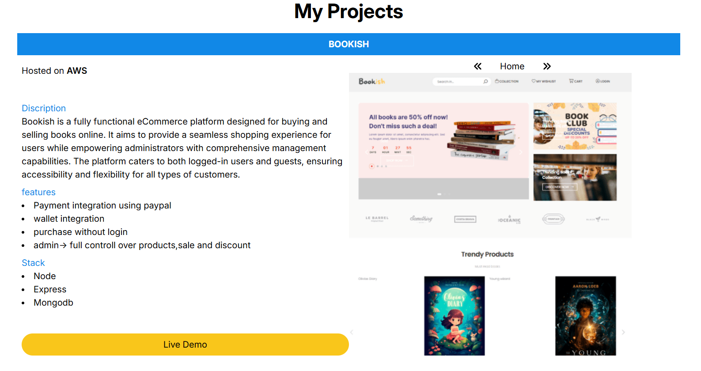

# 💼 Portfolio Website

Welcome to my personal portfolio website! Built using modern web technologies, this portfolio highlights my work as a full-stack web developer, including featured projects, a summary of my skills, and a way to get in touch.

🔗 **Live Demo**: [myportfolio-ys52.onrender.com](https://myportfolio-ys52.onrender.com)

---

## 📌 Features

- ✨ **Interactive UI** with responsive design
- 🧠 **Project showcase** with links and descriptions
- 📬 **Contact section** to connect with me
- 🧰 Built with **React**, **Tailwind CSS**, and hosted on **Render**

---

## 🛠️ Tech Stack

- **Frontend**: React, Vite, Tailwind CSS
- **Deployment**: Render

---

## 📷 Screenshots


*Landing page with my name and role*


*List of my key projects with links*

> 📸 *You can add screenshots inside a `/screenshots` folder in your repo*

---

## 🚀 Getting Started

To run this project locally:

1. Clone the repo  
   ```bash
   git clone https://github.com/your-username/myportfolio.git
   cd myportfolio
